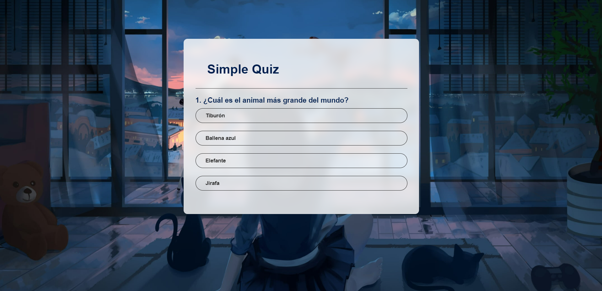

# Simple Quiz App

Este es un proyecto de una aplicación web de cuestionario simple con HTML, CSS y JavaScript. Los usuarios pueden responder preguntas y recibir retroalimentación instantánea sobre sus respuestas.
## Demostración

Puedes probar una demostración en vivo de este proyecto en el siguiente enlace:

[Demo del Quiz](https://simple-quiz-proyect.vercel.app/)

## Captura de Pantalla

## Características

- Muestra preguntas y opciones de respuesta.
- Proporciona retroalimentación visual sobre las respuestas correctas e incorrectas.
- Registra la puntuación del usuario.
- Permite reiniciar el cuestionario.

## Uso

1. Clona o descarga este repositorio en tu computadora.
2. Abre el archivo `index.html` en tu navegador web.
3. Responde las preguntas del cuestionario.
4. Observa la retroalimentación y tu puntuación.
5. Puedes reiniciar el cuestionario al final si lo deseas.

## Tecnologías Utilizadas

- HTML
- CSS
- JavaScript

## Contribución

Si deseas contribuir a este proyecto, puedes seguir estos pasos:

1. Haz un fork del repositorio.
2. Crea una rama (branch) para tu contribución.
3. Realiza tus cambios y commit.
4. Abre un pull request para que se revisen tus cambios.
